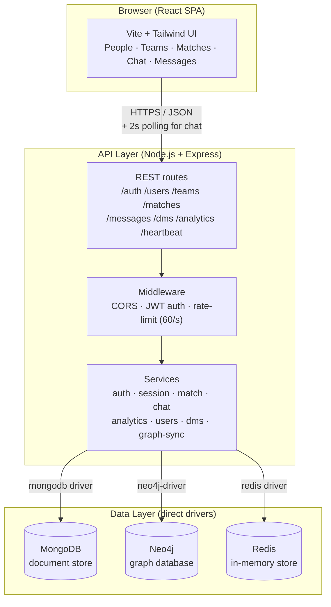
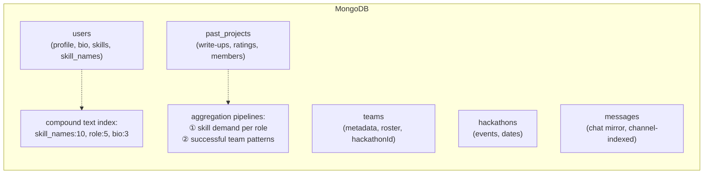
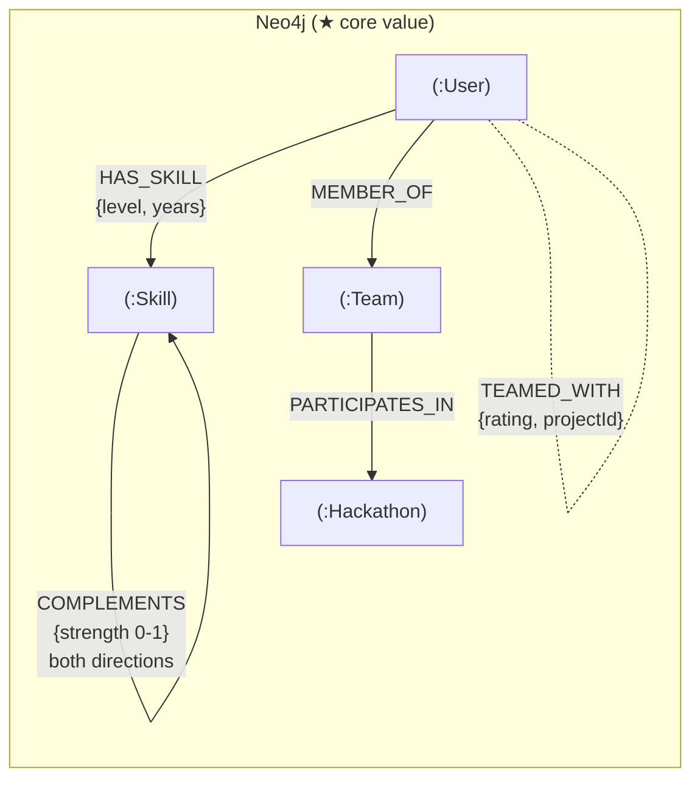
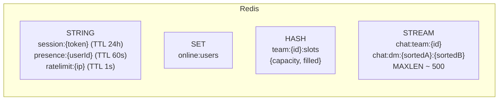
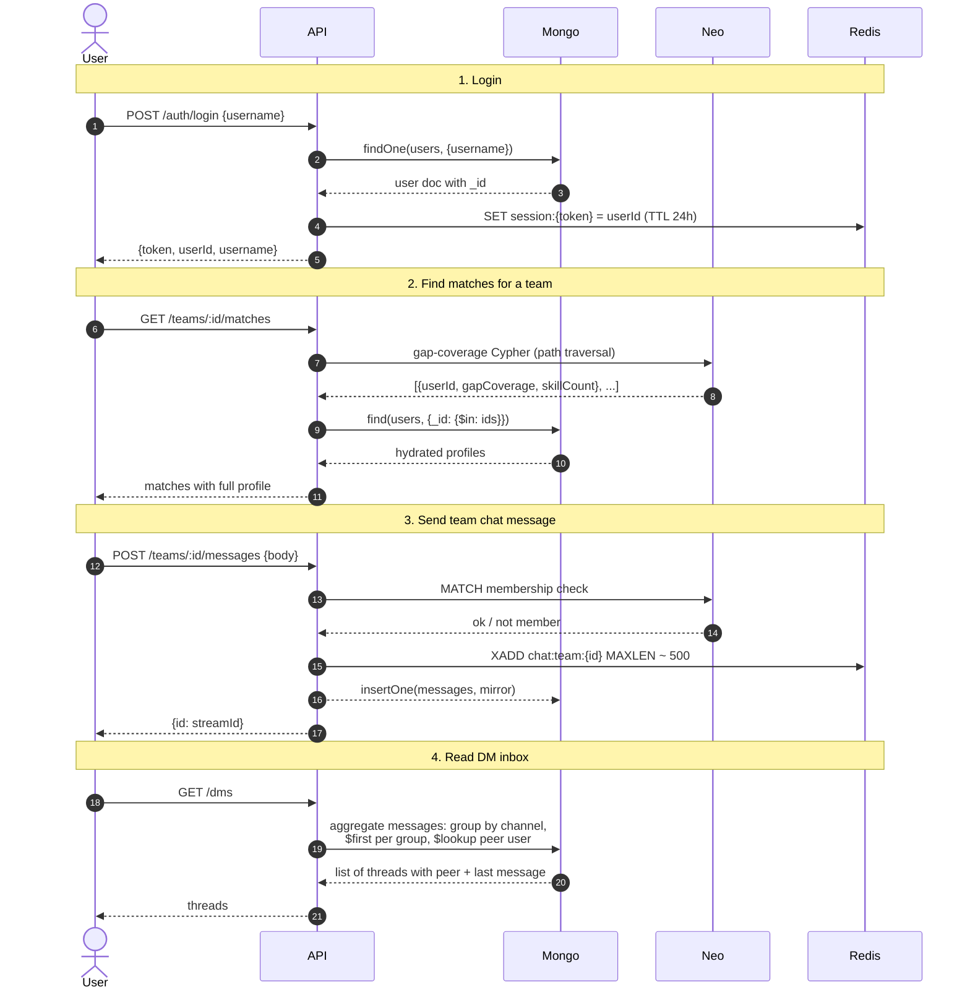

# SynergyHack — System Architecture

This document is the source of truth for the system topology. Everything
below reflects the code as it actually runs (May 2026), not aspirational
design.

## High-level picture

No Socket.io. No GraphQL. No ORM. Just three direct database drivers
behind a thin Express service layer, talked to by a polling React SPA.

## What each database is used for

## Key flows

## Why each database earns its place

| Database | Earns its seat by handling | If you removed it, what breaks |
|---|---|---|
| **MongoDB** | Profile content (bios, skill objects, past project text), 2 aggregation pipelines, text search via compound index, durable archive of every chat message | Profile pages can't render, analytics pipelines have no data, search becomes regex over arrays, chat history loses durability beyond the 500-message Stream cap |
| **Neo4j** | Gap-coverage match algorithm via path traversal, team membership check, skill complementarity graph | The whole match feature is the project's main value — without graph traversal you'd need recursive joins or pre-joined denormal tables in Mongo, neither of which scales as the catalogue grows |
| **Redis** | Session storage with TTL, presence with auto-expiry, atomic slot counters, real-time chat via Streams (capped log), rate limiter | Sessions become a JWT-only bearer (no revocation), no presence, no real-time chat, every API request hits the DB without throttling |

## What is NOT in the system (despite older docs)

These were in the original deck or older drawio versions but are not
implemented in v1:

- **Socket.io** — chat uses HTTP polling at 2s intervals. Polling is
  simpler to demo and reliable across browser tabs. Real-time push is
  a future iteration.
- **Recharts** — analytics endpoints exist but no charting library is
  installed. The viva-grade demonstration is via JSON output, not a
  visual chart.
- **`/events` route, leaderboard ZSET, recent-joins LIST** — earlier
  designs included these; the current code does not use them.
- **Role / Project nodes in Neo4j** — schema constraints are reserved
  for future use but no nodes of these types are seeded.

## Service modules — single source of truth

| Module | File | Owns |
|---|---|---|
| Auth | `services/auth.service.js` | JWT sign/verify (stub login) |
| Sessions | `services/session.service.js` | Redis-backed session store |
| Match | `services/match.service.js` | Gap-coverage Cypher query |
| Chat | `services/chat.service.js` | Streams XADD/XRANGE + Mongo mirror + membership check |
| Analytics | `services/analytics.service.js` | The two aggregation pipelines |
| Users | `services/users.service.js` | Browse / profile / search |
| DMs | `services/dms.service.js` | DM inbox aggregation |
| Graph sync | `services/graph-sync.service.js` | Cross-DB write boundary (User/Team/membership go to both Mongo and Neo4j) |
| Skill | `services/skill.service.js` | Skill catalogue + COMPLEMENTS seed and reads |
| Slot | `services/slot.service.js` | Atomic slot counters in Redis (reserved) |

`graph-sync.service.js` is the disciplined choke point: any code that
needs to keep Mongo and Neo4j in sync (e.g. creating a User, joining a
Team) goes through it. No route writes to two databases on its own.
